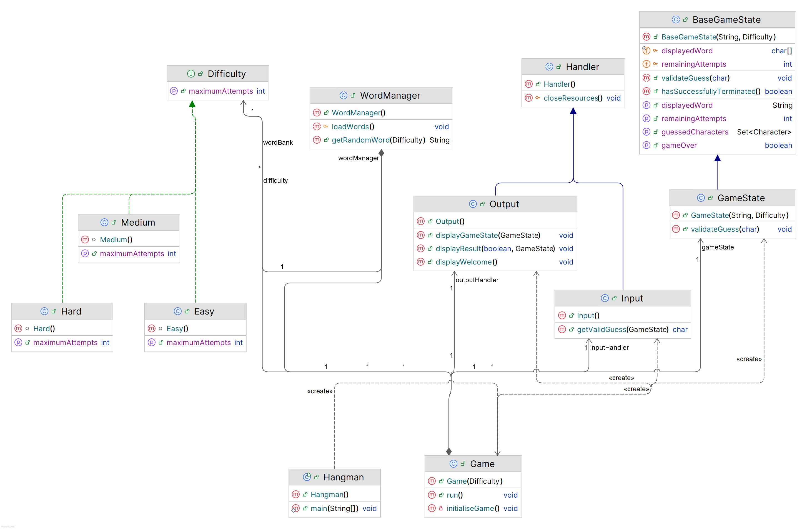

# Hangman

**A Java-based implementation of Hangman with configurable difficulty levels.**

---

## UML Class Diagram



## Features

-   **Difficulty Selection**: Choose between Easy (10 attempts), Medium (8 attempts), or Hard (6 attempts).
-   **Word Management**: Words are loaded from a file and assigned to difficulty tiers.
-   **Game State Tracking**: Displays guessed letters, remaining attempts, and the partially revealed word.
-   **Input/Output Handling**: Robust validation for user inputs and clear feedback via the console.

---

## Prerequisites

-   **Java JDK 8 or higher** (to compile and run the project).
-   A `words.txt` file in the project directory.

---

## Installation & Usage

1. **Clone the repository** or download the source files (e.g. `git clone https://github.com/mjsandagi/hangman`).
2. **Ensure `words.txt` is present** in the root directory.
3. **Compile and run**:
    ```powershell
    javac Hangman.java
    java Hangman
    ```

Enjoy the game!
